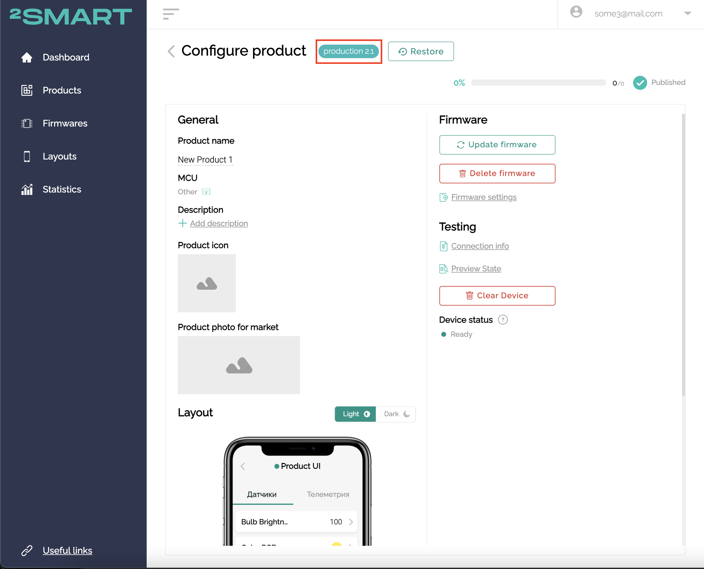

## Device Versioning

1. Device version should be published in topic `$fw/version`. 

2. Version number should be consistent with major part of product version in 2Smart Cloud (e.g. for version `2.1` firmware version should be `2`).

    

3. This version is used to pick correct version of Layout for device. If multiple major versions are present last minor version will be picked wich is correlated with firmware version (e.g. if there are `1.0`, `2.0`, `2.1`, `2.2`, `3.0` product versions and current firmware on device publish version `2` then in mobile app will be picked layout of product version `2.2`).