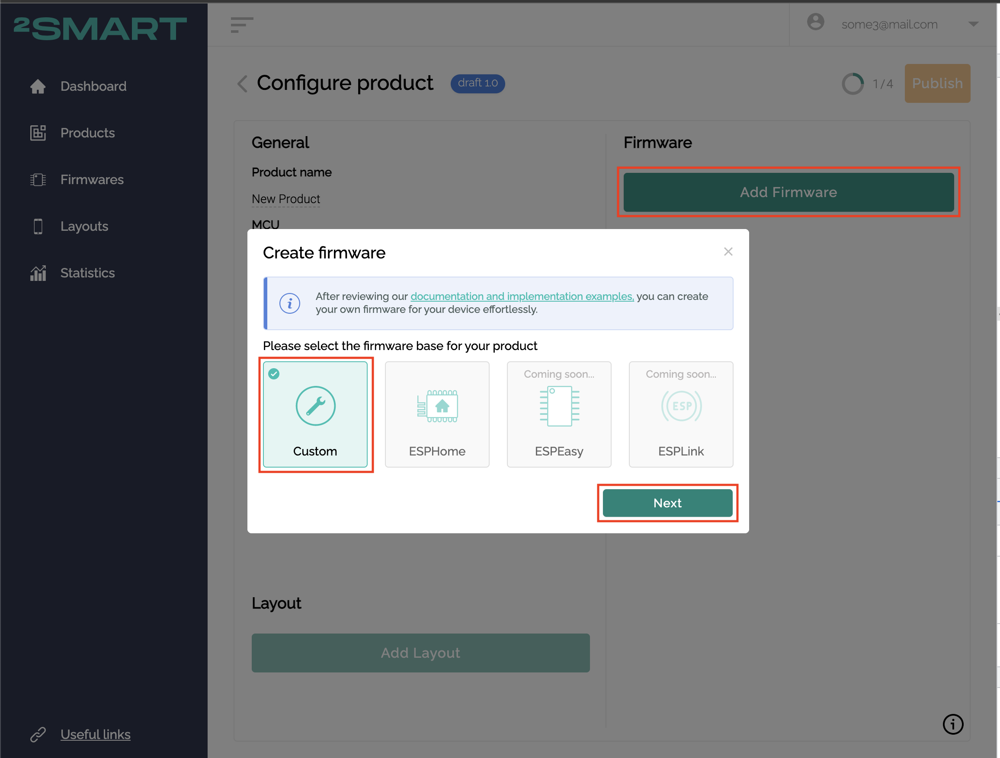
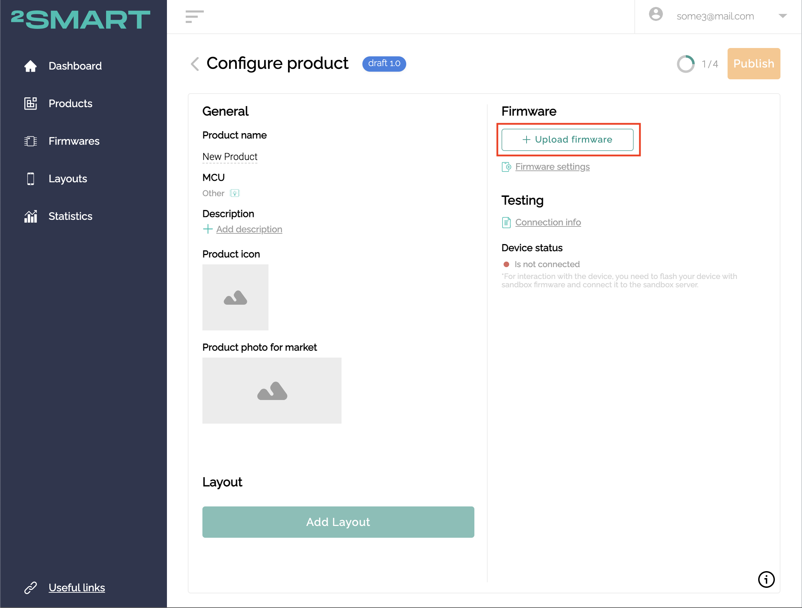

## Firmware update

### Custom firmware

For products with custom firmware uploaded file should be binary which then is used as file for getting update by device over the air (OTA). This file is uploaded in product hub interface.

1. When new product created should be chosen custom firmware option.

    

2. Then upload firmware button used to pick binary file.

    

3. After that uploaded file will be available for device using endpoint: `https://cloud.2smart.com/firmwares/v1/<product_id>.bin`, where `<product_id>` - id of your product in 2Smart Cloud system. Each time you publish new version binary file will be replaced wth new one, so your devices will be able to get updates.

4. To check last firmware version devices should use endpoint: `https://cloud.2smart.com/firmwares/v1/products/<product_id>/firmware-version`, which return payload with JSON object containing current firmware version of product, like this:

    ```JSON
    {
        "firmware_version" : 5
    }
    ```

### EspHome firmware

After publishing product based on EspHome firmware system automatically upload binary to same location from which it's available for devices: `https://cloud.2smart.com/firmwares/v1/<product_id>.bin`. Each time new version published binary is replaced with new one.